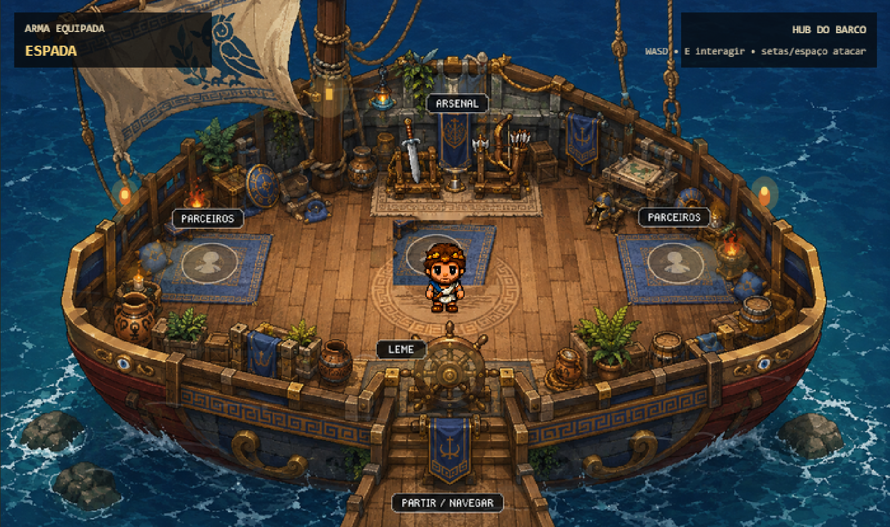
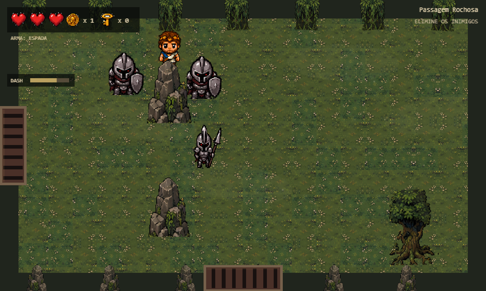
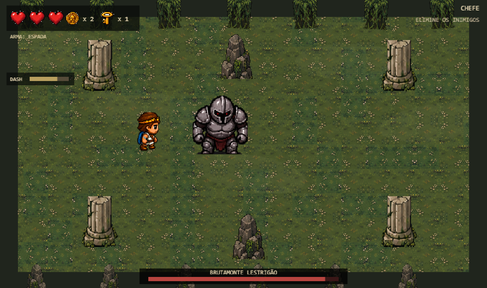
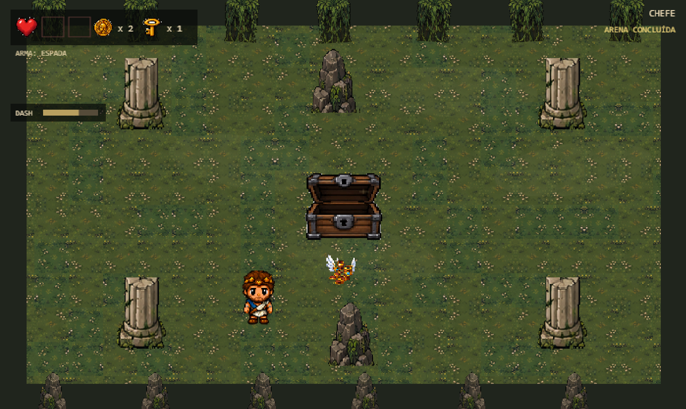

# Odisseia

> Roguelike top-down inspirado na Odisseia e na mitologia grega, desenvolvido em equipe no Construct 3 como projeto acadêmico de Ciência da Computação na PUCPR.
**Status:** Em desenvolvimento

## Sobre o projeto

Odisseia é um jogo roguelike top-down inspirado na obra de Homero e na mitologia grega.

O projeto está sendo desenvolvido em equipe como parte de uma disciplina do curso de Ciência da Computação da PUCPR.

A proposta é transformar elementos da jornada de Odisseu em mecânicas de um roguelike, utilizando salas, combate, diferentes estilos de armas, itens, inimigos e chefes inspirados na mitologia.

## Gameplay

O jogador progride por diferentes salas, enfrenta inimigos e recebe recompensas durante sua jornada.

O sistema de combate foi planejado em torno de três estilos de arma:

- Arma leve
- Arma pesada
- Arco e flecha

## Bosses

Algumas salas culminam em encontros com chefes inspirados nos desafios da jornada de Odisseu.

## Progressão

Após determinados encontros, o jogador pode receber recompensas que contribuem para sua progressão.

## Minha contribuição

Minha participação no projeto envolve tanto a concepção quanto o desenvolvimento do jogo.

- Propus a ideia de desenvolver um roguelike inspirado na **Odisseia** e em elementos da mitologia grega.
- Participei do **game design**, especialmente na criação e no desenvolvimento dos conceitos dos itens.
- Desenvolvi no **Construct 3 a primeira versão jogável do projeto**, implementando o protótipo inicial utilizado como base para a evolução do jogo.
- Participo dos testes, discussões e iterações das mecânicas junto à equipe.

O projeto continua sendo desenvolvido de forma colaborativa, com diferentes integrantes contribuindo para sua evolução.

