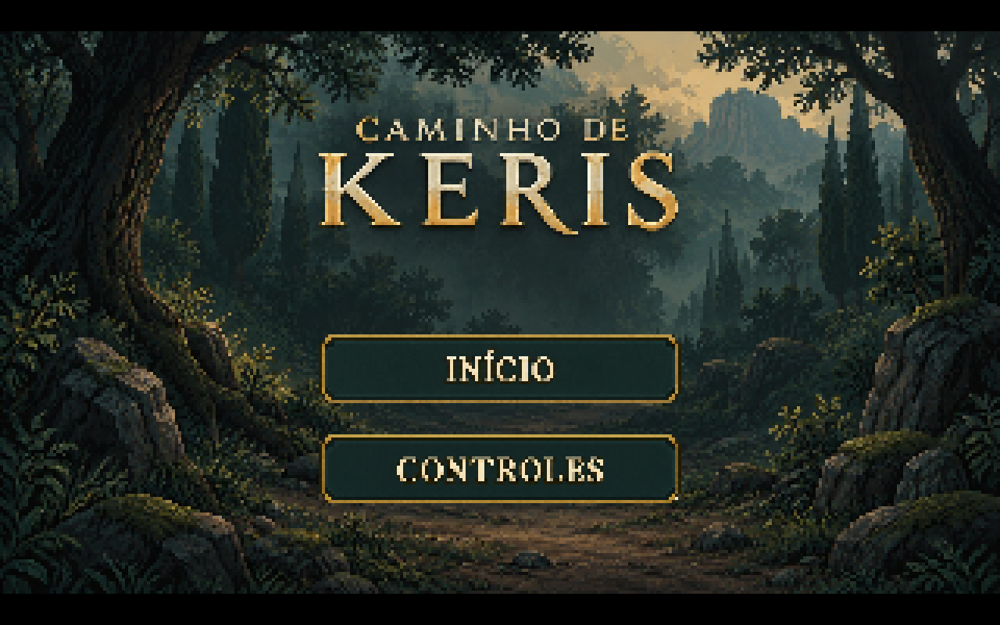
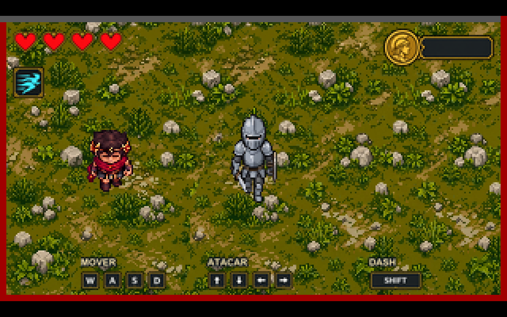
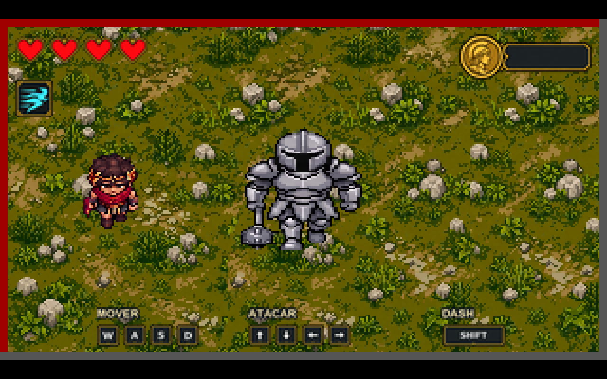

# Odisseia — Caminho de Keris

> Jogo de ação 2D top-down inspirado na jornada de Odisseu, desenvolvido em equipe no Construct 3 como projeto acadêmico de Ciência da Computação na PUCPR.

**Status: projeto acadêmico concluído.** Versão final: `Odisseia_Final_v3.c3p`.

## Conheça o jogo

Após deixar Troia, Odisseu chega à Ilha dos Lestrigões. Explore salas geradas proceduralmente, enfrente os inimigos com sua espada e sobreviva até o confronto com o chefe da ilha.

O projeto foi desenvolvido por cinco estudantes na disciplina **Experiência Criativa — Explorando Computação e Inteligência Artificial**, da PUCPR. “Odisseia” é o nome do projeto; “Caminho de Keris” é o título apresentado na tela inicial.

### O que está na versão final

- Uma ilha com salas conectadas, geradas por random walk em uma grade 5 × 5.
- Movimentação em oito direções, combate com espada e dash.
- Portas que permanecem trancadas enquanto houver inimigos na sala.
- Quatro corações de vida e coleta de moedas ao derrotar inimigos.
- Inimigos comuns e um chefe dos Lestrigões.
- Menu inicial, painel de controles, telas de derrota e vitória e reinício da partida.

## Baixar e executar

**[Baixar o projeto final para Construct 3](Odisseia_Final_v3.c3p?raw=true)** · **[Ler o GDD final 3.1](GDD_Odisseia_Final_3.1.pdf)**

1. Baixe o arquivo `Odisseia_Final_v3.c3p`.
2. Abra o arquivo no [editor do Construct 3](https://editor.construct.net/).
3. Execute a pré-visualização do projeto a partir do layout **Menu**.
4. Clique em **Início** para começar.

O `.c3p` é o projeto editável do Construct 3, com eventos e assets. Ele não é um executável independente nem uma versão publicada para jogar diretamente no navegador.

| Ação | Controle |
|---|---|
| Mover | W, A, S, D |
| Atacar | Setas direcionais |
| Dash | Shift |

## Minha contribuição

Sou **Otávio Piragine Kavinski**, estudante de Ciência da Computação na PUCPR. Conforme o GDD final, participei de quatro áreas do projeto:

- **Programação no Construct 3**, compartilhada com Hamilton Licheski Filho.
- **Design de jogo e narrativa**, junto a Gabriel Grochocki da Silva e Bruno César Souza Ferreira.
- **Documentação**, compartilhada com Hamilton Licheski Filho.
- **Produção e coordenação**, compartilhadas com Hamilton Licheski Filho.

O desenvolvimento foi colaborativo. Os sistemas descritos neste repositório representam o resultado da equipe; os créditos abaixo registram a divisão de responsabilidades.

## Equipe

Responsabilidades registradas na seção 9 do GDD final 3.1, de 20/09/2026:

| Área | Responsáveis |
|---|---|
| Programação — Construct 3 | Hamilton Licheski Filho e Otávio Piragine Kavinski |
| Design de jogo e narrativa | Gabriel Grochocki da Silva, Bruno César Souza Ferreira e Otávio Piragine Kavinski |
| Arte e assets, incluindo geração assistida por IA | Rafael Freitas Cazula de Oliveira |
| Documentação | Hamilton Licheski Filho e Otávio Piragine Kavinski |
| Produção e coordenação | Hamilton Licheski Filho e Otávio Piragine Kavinski |

## Desenvolvimento e escopo

A lógica do jogo utiliza os eventos do Construct 3, com variáveis, arrays, condições e repetições para organizar a geração das salas, o combate e as transições de estado. A estrutura do mapa é armazenada no array `MapaSalas`, e a contagem de inimigos controla a abertura das portas.

Para concluir o projeto no prazo acadêmico de um mês, a equipe concentrou o escopo em uma ilha, uma espada e um chefe. Barco, companheiros, outras ilhas, baús, arco e o confronto com Poseidon ficaram fora da entrega final.

### Ajustes da versão final v3

- Alcance da espada ampliado de 44 para 56 pixels.
- Velocidade dos inimigos e do chefe reduzida em 20%.
- Chefe com 100 pontos de vida e dano de 1 coração.
- Área vulnerável do jogador reduzida e área de ataque ampliada.

**Sobre o GDD:** o documento 3.1 registra o escopo e os créditos finais, mas antecede os últimos ajustes do jogo. Nele, o chefe ainda aparece com 300 pontos de vida e dano de 2 corações, e o status do menu não foi atualizado. Para esses detalhes, valem o arquivo final v3 e as notas acima.

### Verificação

O registro de testes da entrega inclui abertura no Construct, menu, controles, combate, morte, reinício e transição de vitória em cenário controlado. A conferência desta publicação validou a integridade do `.c3p` e a leitura de seus arquivos JSON; não representa uma nova rodada de testes de gameplay.

## Histórico do projeto

A [versão anterior V3.8](Odisseia_V3_8_SistemaDeItens.c3p?raw=true) foi preservada como registro do desenvolvimento. Sua numeração pertence a uma etapa anterior e não indica que seja mais recente que `Odisseia_Final_v3.c3p`.

O [vídeo do protótipo no Google Drive](https://drive.google.com/file/d/1pOx2Wtugwh8vLxMX7yTQbNUXS8hoGke4/view) e as imagens antigas deste repositório mostram uma etapa anterior, incluindo o barco. Eles não representam o escopo final.

## Referências e apoio de IA

Referências de design registradas no GDD: **The Binding of Isaac** (salas, câmera e gameplay), **Hades** e **Cult of the Lamb** (direção visual), e **Enigma do Medo** (proporções dos cenários).

O projeto contou com apoio do ChatGPT na organização e revisão da lógica, em ajustes do jogo e na documentação. O GDD registra geração assistida por IA na área de arte e assets; a lista de ferramentas planejadas no documento não confirma o uso individual de cada ferramenta.

---

[GitHub de Otávio](https://github.com/ot444444) · [LinkedIn](https://www.linkedin.com/in/otavio-kavinski-4538a22b6/)

